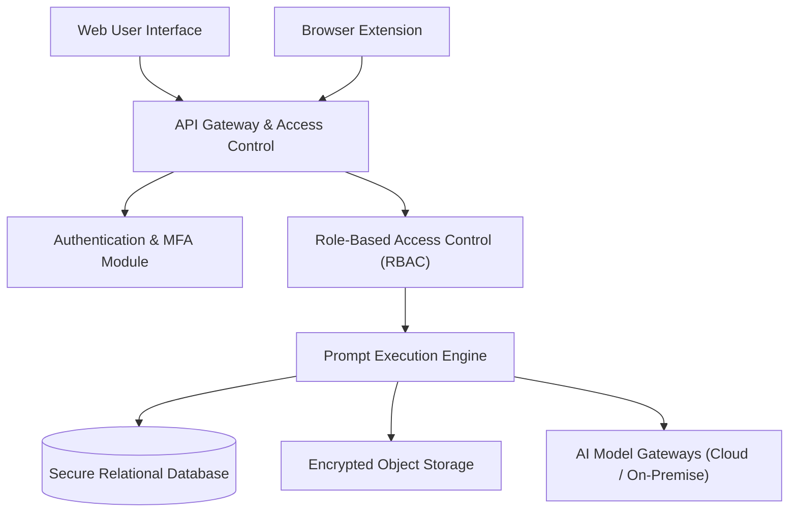
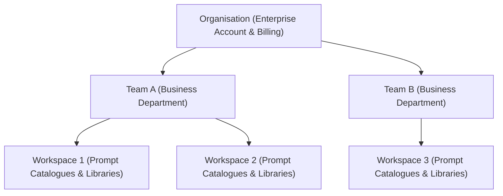

This document provides an overview of the Power Prompt system architecture, its modular component decoupling, enterprise security model, and multi-tenant isolation guarantees.

---

## 1. Architectural Principles & Technology Stack

Power Prompt is designed with a decoupled, high-performance architecture engineered for enterprise data sovereignty, operational resilience, and horizontal scalability.

### Core Backend & Execution Engine

- **API Engine:** High-performance Node.js asynchronous runtime designed for minimal overhead, rapid prompt streaming, and strict request schema enforcement.
- **Language:** Strictly typed TypeScript throughout all service layers.
- **Relational Storage:** PostgreSQL (version 17 or higher), providing strict ACID transactional guarantees and logical tenant partitioning.
- **Session & Identity Governance:** Short-lived cryptographically signed access tokens, reinforced by Multi-Factor Authentication (TOTP MFA) and enterprise Single Sign-On (OAuth 2.0 / SAML).
- **AI Model Gateways:** Multi-provider abstraction facilitating secure connections to European cloud gateways (Azure OpenAI, Anthropic) or sovereign self-hosted inference servers (vLLM, Ollama, TGI).

### Frontend User Interface (Web Dashboard)

- **Architecture:** Optimised single-page application (SPA) distributed as pre-compiled static assets for near-instantaneous page loads.
- **Client Security:** Complete context isolation and strict enforcement of Content Security Policy (CSP) headers.

---

## 2. Data Flow & Conceptual Architecture

The diagram below illustrates the secure request trajectory from client interfaces down to relational storage and external AI model endpoints:

### Prompt Execution Lifecycle

1. **Secure Transmission:** The client (web dashboard or browser extension) dispatches dynamic variables along with the prompt identifier over an encrypted HTTPS connection.
2. **Access Verification:** The gateway authenticates user identity, validates active team membership, and confirms necessary permissions on the target workspace.
3. **Interpolation & Formatting:** The execution service loads the approved prompt template version, substitutes input parameters, and applies syntax formatting.
4. **Model Invocation:** The validated payload is dispatched to the enterprise-approved AI provider, preventing unauthorised outbound data transfers.
5. **Audit Logging & Telemetry:** Token counts and execution metadata are written to an encrypted audit log for cost tracking and compliance monitoring.
6. **Delivery:** The generated output is returned to the client as an event stream or a structured JSON response.

---

## 3. Application Security Guarantees

### Data Encryption

* **Data in Transit:** All network traffic requires TLS 1.3 encryption.
* **Data at Rest:** External API credentials, integration tokens, and sensitive customer parameters are symmetrically encrypted in storage using AES-256-GCM with independent key rotation.

### Abuse Mitigation (Rate Limiting)

Adaptive rate limiting protects platform ingress points against distributed denial-of-service attempts and brute-force authentication attacks.

### Content Security Policy (CSP)

The web dashboard enforces strict CSP directives, preventing unverified script injections, cross-site scripting (XSS), and data exfiltration.

---

## 4. Multi-Tenant Architecture & Access Control

Power Prompt implements a deterministic multi-tenant isolation model designed to eliminate cross-tenant data leakage while maintaining high system throughput.

### 4.1 Strict Tenancy Invariant: 1 User = 1 Organisation

To eliminate permission confusion, ambiguity, and unintended cross-tenant access:
* Every user account (keyed by email address) belongs exclusively to a single organisation boundary.
* This isolation boundary is enforced at the database transaction layer, rendering cross-organisation privilege bleed structurally impossible.

### 4.2 Three-Tier Access Hierarchy

Resource ownership and delegation follow a strict three-tier containment model:

1. **Organisation:** Enterprise customer account, contract boundaries, and administrative governance.
2. **Team:** Functional business department (e.g. Legal, Marketing, Engineering, Customer Care).
3. **Workspace:** Collaborative working container holding prompt libraries, model configurations, and process workflows.

### 4.3 Atomic Deprovisioning & Immediate Revocation

When a user departs the organization or is decommissioned by an administrator, the platform triggers an atomic deprovisioning sequence:
* Access permissions to all assigned teams and workspaces are instantly revoked.
* In-flight session tokens for the account are immediately invalidated.
* User-scoped API keys are deactivated in real time.

---

## 5. Enterprise Deployment Models

Power Prompt adapts to diverse enterprise security postures and infrastructure requirements:

* **Managed European SaaS:** Hosted in European data centres compliant with ISO 27001, SOC 2, and EU GDPR standards, featuring automated encrypted backups and high availability.
* **On-Premise / Private Cloud:** Organisations requiring full physical control can deploy Power Prompt within their own sovereign infrastructure using containerised packages. Refer to the [On-Premise Deployment Guide](/installation/on-premise/) for setup instructions.
