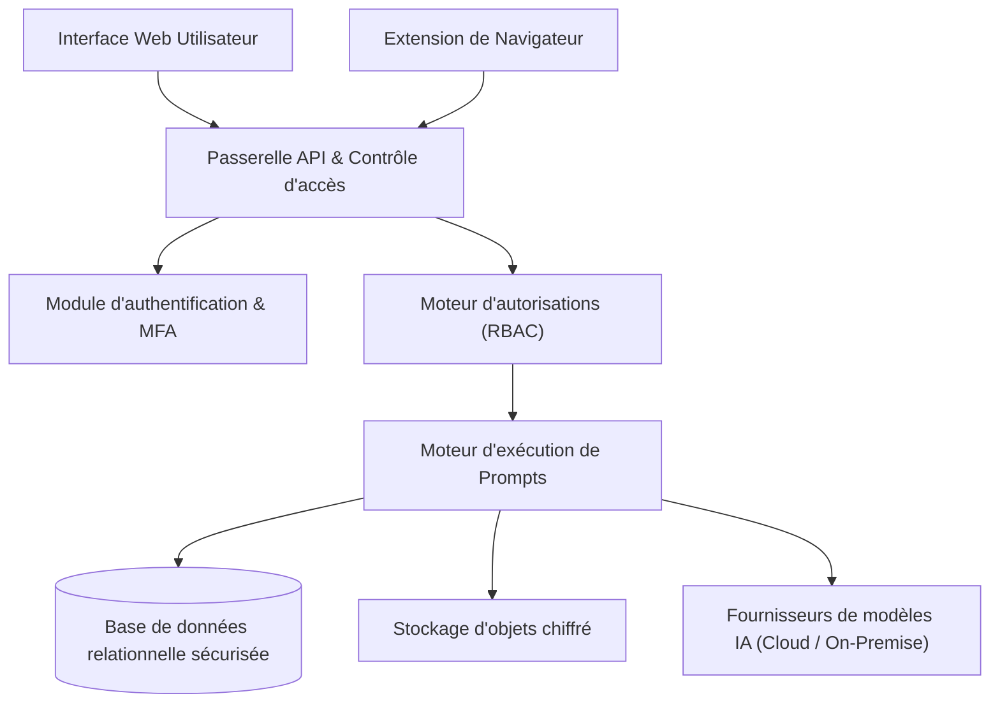
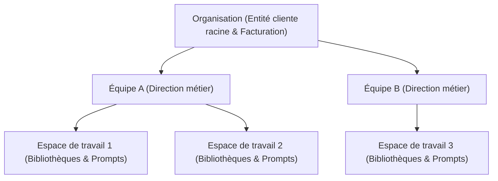

Ce document présente l'architecture globale de la plateforme Power Prompt, ses principes de découplage technologique, son modèle de sécurité multi-tenant et ses capacités d'intégration en entreprise.

---

## 1. Principes d'architecture & Pile technologique

Power Prompt repose sur une architecture moderne modulaire à haute performance, conçue pour répondre aux exigences de souveraineté des données, de résilience et de scalabilité.

### Backend applicatif & Moteur d'exécution

- **Moteur d'API :** Framework Node.js à très haute performance et faible latence, assurant le traitement asynchrone des flux de prompts et la validation stricte des schémas de requêtes.
- **Langage :** TypeScript strict avec typage de bout en bout.
- **Base de données relationnelle :** PostgreSQL (version 17 ou ultérieure), garantissant l'intégrité transactionnelle ACID et le partitionnement logique des données.
- **Gestion des sessions & Authentification :** Jetons cryptographiques d'accès à courte durée, complétés par l'authentification multi-facteurs (MFA TOTP) et l'intégration SSO d'entreprise (OAuth 2.0 / SAML).
- **Passerelles de modèles IA :** Abstraction multi-fournisseurs permettant de connecter des API cloud sécurisées hébergées en Europe (Azure OpenAI, Anthropic) ou des serveurs d'inférence souverains auto-hébergés (vLLM, Ollama, TGI).

### Interface utilisateur (Tableau de bord Web)

- **Architecture :** Application web monopage (SPA) optimisée, distribuée sous forme statique pour une vitesse de chargement instantanée.
- **Sécurité de navigation :** Isolation complète des contextes et respect rigoureux des politiques de sécurité du contenu (CSP).

---

## 2. Flux de données & Diagramme conceptuel

Le schéma ci-dessous illustre le cheminement sécurisé d'une interaction utilisateur, depuis les interfaces clientes jusqu'aux modèles d'intelligence artificielle :

### Cycle d'exécution d'un prompt

1. **Transmission sécurisée :** Le client (interface web ou extension de navigateur) transmet les variables dynamiques avec l'identifiant du prompt via un canal chiffré HTTPS.
2. **Contrôle d'accès :** La passerelle valide l'identité de l'utilisateur, vérifie son appartenance à l'équipe et s'assure qu'il détient les permissions requises sur l'espace de travail cible.
3. **Interpolation & Préparation :** Le moteur récupère la version approuvée du modèle de prompt, substitue les variables et applique les règles de formatage.
4. **Appel au modèle IA :** La requête est transmise au fournisseur de modèle homologué par l'administrateur, garantissant qu'aucune donnée n'est envoyée vers des modèles non autorisés.
5. **Consignation & Traçabilité :** Le volume de jetons consommés et les métadonnées d'exécution sont enregistrés dans le journal d'audit interne pour le suivi budgétaire.
6. **Restitution :** Le contenu généré est renvoyé en flux continu ou sous forme de structure JSON sécurisée au client.

---

## 3. Garanties de sécurité applicative

### Chiffrement des données

* **Données en transit :** Toutes les communications sont obligatoirement chiffrées selon le protocole TLS 1.3.
* **Données au repos :** Les clés d'API externes, les secrets d'intégration et les données sensibles sont chiffrés en base de données à l'aide d'un algorithme symétrique AES-256-GCM avec gestion de clés indépendantes.

### Protection contre les abus (Rate Limiting)

Une limitation de débit adaptative protège l'ensemble des points d'entrée de la plateforme contre les attaques par déni de service (DDoS) et les tentatives de force brute sur les formulaires d'authentification.

### Politique de sécurité du contenu (CSP)

L'application web applique des en-têtes CSP restrictifs interdisant tout chargement de scripts externes non homologués et protégeant les utilisateurs contre les attaques XSS et l'injection de code.

---

## 4. Modèle Multi-Tenant & Cloisonnement des données

Power Prompt met en œuvre un modèle d'isolation multi-locataire déterministe garantissant une étanchéité absolue entre organisations clientes.

### 4.1 Invariant d'isolation : 1 Compte = 1 Organisation

Pour éliminer tout risque de fuite de données entre locataires ou de confusion de privilèges :
* Chaque compte utilisateur est rattaché de manière exclusive à une seule organisation d'entreprise.
* Cette règle d'étanchéité est garantie au niveau transactionnel de la base de données, rendant structurellement impossible le partage accidentel d'un compte entre deux entités clientes distinctes.

### 4.2 Hiérarchie structurelle des accès

L'organisation des accès repose sur une structure à trois niveaux :

1. **Organisation :** Périmètre institutionnel et contractuel de l'entreprise cliente.
2. **Équipe :** Département métier ou pôle d'activité (ex: Marketing, Juridique, Support).
3. **Espace de travail :** Espace opérationnel de collaboration contenant les bibliothèques de prompts, les configurations de modèles IA et les processus associés.

### 4.3 Révocation instantanée et déprovisionnement

Lorsqu'un collaborateur quitte l'entreprise ou change de fonction, sa suppression au niveau de l'organisation déclenche une transaction atomique :
* Tous ses droits d'accès aux équipes et espaces de travail sont révoqués instantanément.
* Tous les jetons de session actifs émis pour ce compte sont immédiatement invalidés.
* Ses clés d'API personnelles sont désactivées en temps réel.

---

## 5. Modes de déploiement en entreprise

Power Prompt s'adapte aux contraintes d'infrastructure de chaque organisation :

* **Cloud SaaS infogéré :** Hébergé au sein de centres de données européens certifiés ISO 27001 et SOC 2, avec haute disponibilité et sauvegardes automatiques chiffrées.
* **Déploiement On-Premise / Cloud Privé :** Possibilité de déployer la solution directement sur l'infrastructure souveraine de l'entreprise (serveurs physiques ou machines virtuelles Linux avec conteneurisation Docker). Pour ce scénario, reportez-vous au [Guide de déploiement On-Premise](/fr/installation/on-premise/).