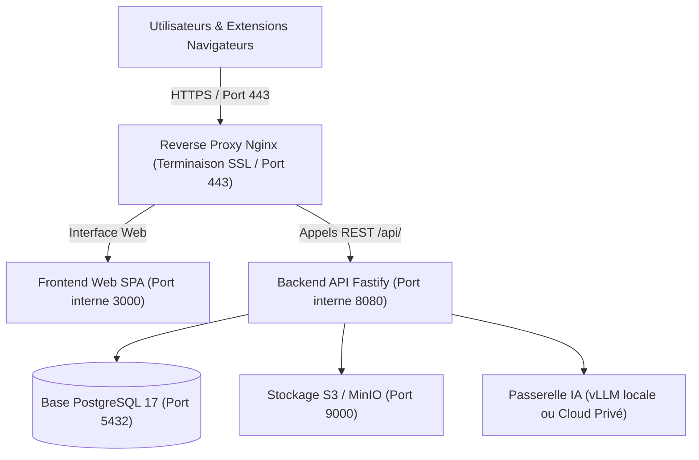

Ce document décrit la procédure d'installation, de configuration et de validation de la plateforme **Power Prompt Enterprise** au sein d'une infrastructure privée (datacenter sur site, cloud privé d'entreprise ou machine virtuelle dédiée).

---

## 1. Architecture générale & Composants

Power Prompt repose sur une architecture conteneurisée modulaire, conçue pour un cloisonnement étanche des données et une conformité stricte aux exigences de souveraineté.



### Composants logiciels

1. **Frontend Web :** Interface utilisateur monopage réactive (Next.js, React 19, canevas à 60 FPS), servie statiquement.
2. **Backend API :** Moteur applicatif léger et performant (Fastify, TypeScript, Node.js 22) gérant l'authentification JWT/TOTP, les contrôles d'accès RBAC et l'orchestration des prompts.
3. **Base de données relationnelle :** PostgreSQL 17 avec extensions cryptographiques.
4. **Stockage d'objets (optionnel) :** Compatible S3 (MinIO interne, Ceph ou AWS S3) pour les pièces jointes volumineuses.
5. **Passerelle d'IA (LLM) :** Connecteurs vers des modèles locaux souverains (vLLM, Ollama) ou des liaisons privées dédiées (Azure OpenAI avec Private Endpoint, AWS Bedrock via VPC).

---

## 2. Prérequis système & Réseau

### Matrice matérielle recommandée

| Profil de déploiement | Utilisateurs actifs | vCPU | RAM | Stockage (SSD NVMe) |
|---|---|---|---|---|
| **Standard (Départemental)** | 1 à 100 utilisateurs | 4 vCPU | 8 Go | 50 Go |
| **Enterprise (Entreprise globale)** | 100 à 1 000+ utilisateurs | 8 vCPU | 16 Go | 150 Go |
| **Haute Disponibilité (Cluster HA)** | Multi-nœuds avec Patroni | 8 vCPU / nœud | 16 Go / nœud | 200 Go répliqués |

### Prérequis logiciels de l'hôte

* **Système d'exploitation :** Linux 64 bits (Debian 12/13, Ubuntu 22.04/24.04 LTS, ou RHEL 9 / Rocky Linux 9).
* **Moteur de conteneurs :** Docker Engine version 24.0 ou ultérieure et Docker Compose v2.20 ou ultérieure.
* **Résolution de nom (DNS) :** Un nom de domaine pleinement qualifié (FQDN), par exemple `powerprompt.entreprise.local`, pointant vers l'adresse IP du serveur hôte.

### Flux réseau et ports d'écoute

* **Entrants (Inbound) :**
  * `443/TCP (HTTPS)` : Trafic utilisateur vers le portail web et l'API (terminaison SSL sur le reverse proxy).
  * `80/TCP (HTTP)` : Redirection automatique vers HTTPS.
* **Internes (Réseau privé Docker) :**
  * `8080/TCP` : Port applicatif du backend (non exposé sur l'interface publique).
  * `3000/TCP` : Port de service du frontend SPA (non exposé sur l'interface publique).
  * `5432/TCP` : Port de la base PostgreSQL (accessible uniquement depuis le réseau conteneur).
* **Sortants (Outbound) :**
  * Port `443/TCP` vers les endpoints de LLM externes (uniquement si vous utilisez Azure OpenAI ou Anthropic).
  * Si vous utilisez un serveur LLM local (vLLM / Ollama), **aucun accès Internet sortant n'est requis**.

---

## 3. Déploiement Conteneurisé via Docker Compose

Cette méthode garantit un déploiement standardisé, rapide et sécurisé au sein d'un environnement isolé.

### Étape 1 : Préparation de l'arborescence

Connectez-vous sur le serveur hôte et préparez l'arborescence d'exploitation :

```bash
sudo mkdir -p /opt/powerprompt && cd /opt/powerprompt
sudo mkdir -p data/postgres data/uploads config
```

### Étape 2 : Authentification au registre de conteneurs

Les images logicielles sont distribuées via un registre de conteneurs sécurisé. Authentifiez votre serveur hôte à l'aide des identifiants remis lors de la souscription :

```bash
echo "VOTRE_JETON_D_ACCES" | sudo docker login ghcr.io -u VOTRE_UTILISATEUR --password-stdin
```

### Étape 3 : Fichier d'environnement (`.env`)

Créez le fichier de configuration `/opt/powerprompt/.env` :

```bash
sudo nano /opt/powerprompt/.env
```

Renseignez les variables d'environnement adaptées à votre infrastructure :

```env
# ==============================================================================
# Configuration Power Prompt Enterprise On-Premise
# ==============================================================================
NODE_ENV=production

# URLs d'accès (FQDN d'entreprise)
FRONTEND_URL=https://powerprompt.entreprise.local
BACKEND_URL=https://powerprompt.entreprise.local/api
ALLOWED_ORIGINS=https://powerprompt.entreprise.local

# Ports internes
FRONTEND_PORT=3000
BACKEND_PORT=8080
DATABASE_PORT=5432

# Base de données PostgreSQL 17
POSTGRES_DB=powerprompt_prod
POSTGRES_USER=pp_admin
POSTGRES_PASSWORD=DefinirIciUnMotDePasseTresRobuste!2026
DB_HOST=database
DB_PORT=5432

# Clés de sécurité cryptographiques (à générer via openssl)
# openssl rand -base64 32
JWT_SECRET=votre_cle_jwt_aleatoire_de_minimum_32_caracteres_ici

# openssl rand -hex 32 (exactement 64 caractères hexadécimaux pour AES-256-GCM)
DATA_ENCRYPTION_KEY=votre_cle_hex_64_caracteres_pour_aes_256_gcm_chiffrement

# Configuration de la passerelle IA principale
# Exemple avec modèle souverain local :
LLM_PROVIDER=openai-compatible
OPENAI_BASE_URL=http://vllm.entreprise.local:8000/v1
OPENAI_API_KEY=local-token-not-evaluated
DEFAULT_LLM_MODEL=meta-llama/Llama-3.3-70B-Instruct
```

Verrouillez immédiatement les permissions d'accès au fichier :

```bash
sudo chmod 600 /opt/powerprompt/.env
sudo chown root:root /opt/powerprompt/.env
```

### Étape 4 : Fichier `docker-compose.yml`

Créez le fichier `/opt/powerprompt/docker-compose.yml` :

```yaml
version: '3.8'

services:
  database:
    image: postgres:17-alpine
    container_name: powerprompt-db
    restart: unless-stopped
    environment:
      POSTGRES_DB: ${POSTGRES_DB}
      POSTGRES_USER: ${POSTGRES_USER}
      POSTGRES_PASSWORD: ${POSTGRES_PASSWORD}
    volumes:
      - ./data/postgres:/var/lib/postgresql/data
    networks:
      - powerprompt-net
    healthcheck:
      test: ["CMD-SHELL", "pg_isready -U ${POSTGRES_USER} -d ${POSTGRES_DB}"]
      interval: 10s
      timeout: 5s
      retries: 5

  backend:
    image: ghcr.io/digital-business-services/powerprompt-backend:latest
    container_name: powerprompt-backend
    restart: unless-stopped
    env_file: .env
    environment:
      DB_HOST: database
      DB_PORT: 5432
      DB_NAME: ${POSTGRES_DB}
      DB_USER: ${POSTGRES_USER}
      DB_PASSWORD: ${POSTGRES_PASSWORD}
    depends_on:
      database:
        condition: service_healthy
    networks:
      - powerprompt-net
    expose:
      - "8080"

  frontend:
    image: ghcr.io/digital-business-services/powerprompt-frontend:latest
    container_name: powerprompt-frontend
    restart: unless-stopped
    env_file: .env
    ports:
      - "127.0.0.1:3000:80"
    depends_on:
      - backend
    networks:
      - powerprompt-net

networks:
  powerprompt-net:
    driver: bridge
```

### Étape 5 : Démarrage des conteneurs et migration

1. Téléchargez les images logicielles et démarrez les conteneurs :

```bash
sudo docker compose up -d
```

2. Exécutez les migrations de schéma initiales :

```bash
sudo docker compose exec backend npm run migrate
```

---

## 4. Configuration du Reverse Proxy Nginx & Terminaison SSL

Pour un environnement de production d'entreprise, un reverse proxy Nginx gère les certificats SSL/TLS de l'organisation et achemine le trafic vers le frontend et l'API.

Créez le fichier de configuration Nginx `/etc/nginx/sites-available/powerprompt.conf` :

```nginx
server {
    listen 80;
    server_name powerprompt.entreprise.local;
    return 301 https://$host$request_uri;
}

server {
    listen 443 ssl http2;
    server_name powerprompt.entreprise.local;

    # Certificats SSL de l'organisation
    ssl_certificate /etc/ssl/certs/powerprompt-entreprise.crt;
    ssl_certificate_key /etc/ssl/private/powerprompt-entreprise.key;

    # Paramètres de sécurité TLS durcis
    ssl_protocols TLSv1.2 TLSv1.3;
    ssl_ciphers HIGH:!aNULL:!MD5;
    ssl_prefer_server_ciphers on;

    # En-têtes de sécurité
    add_header X-Frame-Options "SAMEORIGIN" always;
    add_header X-Content-Type-Options "nosniff" always;
    add_header X-XSS-Protection "1; mode=block" always;
    add_header Content-Security-Policy "default-src 'self'; script-src 'self' 'unsafe-inline'; style-src 'self' 'unsafe-inline'; connect-src 'self' https:;" always;

    # Frontend SPA
    location / {
        proxy_pass http://127.0.0.1:3000;
        proxy_http_version 1.1;
        proxy_set_header Upgrade $http_upgrade;
        proxy_set_header Connection 'upgrade';
        proxy_set_header Host $host;
        proxy_set_header X-Real-IP $remote_addr;
        proxy_set_header X-Forwarded-For $proxy_add_x_forwarded_for;
        proxy_set_header X-Forwarded-Proto https;
        proxy_cache_bypass $http_upgrade;
    }

    # Passerelle API
    location /api/ {
        proxy_pass http://127.0.0.1:8080/;
        proxy_http_version 1.1;
        proxy_set_header Host $host;
        proxy_set_header X-Real-IP $remote_addr;
        proxy_set_header X-Forwarded-For $proxy_add_x_forwarded_for;
        proxy_set_header X-Forwarded-Proto https;
        
        # Gestion des temps de traitement pour les générations IA complexes
        proxy_connect_timeout 60s;
        proxy_send_timeout 180s;
        proxy_read_timeout 180s;
    }
}
```

Activez le site et rechargez Nginx :

```bash
sudo ln -s /etc/nginx/sites-available/powerprompt.conf /etc/nginx/sites-enabled/
sudo nginx -t
sudo systemctl reload nginx
```

---

## 5. Connexion aux Passerelles LLM d'Entreprise

Power Prompt s'interface avec vos moteurs d'IA selon vos contraintes de sécurité et de conformité :

### Option 1 : Modèles souverains 100% locaux (Zero Cloud Egress)

Si la politique de sécurité de votre organisation interdit toute sortie vers des clouds externes :
1. Déployez un serveur d'inférence local (ex: **vLLM** ou **Ollama**) sur un serveur équipé de cartes GPU internes (Nvidia RTX, A100 ou H100).
2. Configurez les variables d'environnement dans `/opt/powerprompt/.env` :
   ```env
   LLM_PROVIDER=openai-compatible
   OPENAI_BASE_URL=http://vllm.entreprise.local:8000/v1
   OPENAI_API_KEY=local-token-not-evaluated
   DEFAULT_LLM_MODEL=meta-llama/Llama-3.3-70B-Instruct
   ```
3. Aucune donnée ne quitte le réseau privé de votre organisation.

### Option 2 : Passerelles Cloud Privées (Azure OpenAI / AWS Bedrock)

Si votre organisation dispose d'abonnements d'entreprise avec chiffrement dédié :
* **Azure OpenAI :** Utilisez l'URL de votre ressource privée (Private Endpoint) et votre clé gérée.
* Les requêtes transitent directement par les tunnels réseau privés ou liaisons VPN/ExpressRoute de votre entreprise.

---

## 6. Vérification post-installation (Smoke Tests)

Pour vérifier le bon fonctionnement de l'installation :

### 1. Contrôle de l'état des conteneurs

```bash
sudo docker compose ps
```

Tous les services doivent afficher le statut `Up` (healthy pour la base de données).

### 2. Contrôle de l'API de santé (Health Check)

```bash
curl -k https://powerprompt.entreprise.local/api/health
```

Réponse JSON attendue :

```json
{
  "status": "ok",
  "database": "connected",
  "version": "1.0.0",
  "timestamp": "2026-09-27T10:00:00.000Z"
}
```

### 3. Première connexion administrateur

1. Ouvrez votre navigateur sur `https://powerprompt.entreprise.local`.
2. Connectez-vous avec les identifiants d'initialisation fournis lors de la livraison.
3. Activez immédiatement l'authentification multi-facteurs (TOTP) sur le compte super-administrateur.
4. Créez votre organisation et vos premiers espaces de travail.

---

## 7. Sauvegardes & Mises à jour

### Sauvegarde automatique quotidienne

Ajoutez une tâche cron pour sauvegarder la base PostgreSQL :

```bash
sudo crontab -e
```

Ajoutez la ligne suivante pour déclencher une sauvegarde chiffrée chaque nuit à 02h00 :

```bash
0 2 * * * docker compose -f /opt/powerprompt/docker-compose.yml exec -T database pg_dump -U pp_admin powerprompt_prod | gzip > /opt/powerprompt/data/backup_pp_$(date +\%Y\%m\%d).sql.gz
```

### Procédure de mise à jour (Upgrade)

Lors de la mise à disposition d'une nouvelle version :

```bash
cd /opt/powerprompt

# 1. Sauvegarde préventive de la base
docker compose exec -T database pg_dump -U pp_admin powerprompt_prod > backup_pre_upgrade.sql

# 2. Récupération des dernières images
sudo docker compose pull

# 3. Redémarrage des services
sudo docker compose up -d

# 4. Application des nouvelles migrations
sudo docker compose exec backend npm run migrate
```

---

## 8. Support technique & Assistance

En cas de question ou de diagnostic complexe :
* **Portail documentaire officiel :** [https://doc.powerprompt.eu](https://doc.powerprompt.eu)
* **Assistance technique :** `support@powerprompt.eu`
* **Éléments à joindre au ticket :**
  1. Version de Power Prompt.
  2. Résultat de la commande `curl https://votre-domaine/api/health`.
  3. Les 50 dernières lignes de logs : `sudo docker compose logs --tail=50 backend`.
