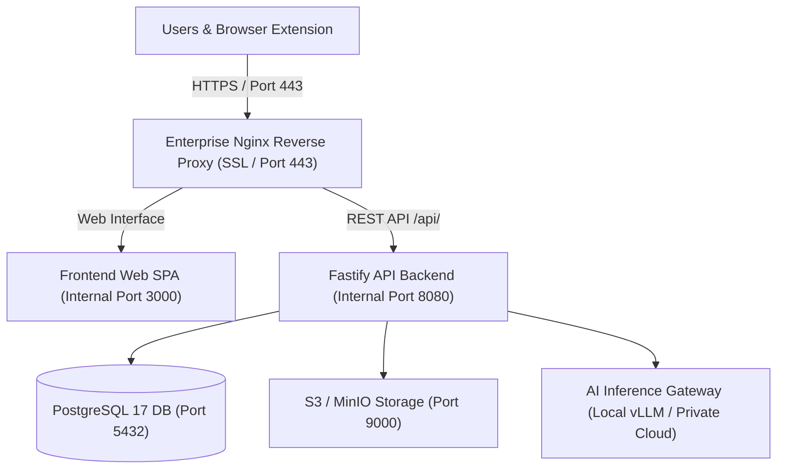

This document details the installation, configuration, and validation procedures for **Power Prompt Enterprise** within a private customer infrastructure (on-premises datacenter, private cloud, or dedicated virtual machine cluster).

---

## 1. System Architecture & Components

Power Prompt features a decoupled, modular, and containerised architecture engineered for strict tenant isolation and sovereign regulatory compliance.



### Core Components

1. **Frontend Web UI:** Modern single-page application (Next.js, React 19, 60 FPS interactive canvas), statically served.
2. **Backend API Gateway:** High-throughput engine (Fastify, TypeScript, Node.js 22) handling JWT/TOTP MFA authentication, RBAC access control, deterministic prompt orchestration, and LLM telemetry.
3. **Relational Database:** PostgreSQL 17 with cryptographic extensions.
4. **Object Storage (Optional):** S3-compatible storage (internal MinIO, Ceph, or AWS S3) for document ingestion and BPMN exports.
5. **AI Inference Gateway:** Sovereign connectors for local LLMs (vLLM, Ollama) or dedicated enterprise cloud endpoints (Azure OpenAI via Private Link, AWS Bedrock via VPC).

---

## 2. Hardware & Network Prerequisites

### Recommended Hardware Matrix

| Deployment Profile | User Count | vCPU | RAM | Storage (NVMe SSD) |
|---|---|---|---|---|
| **Standard (Departmental)** | 1 to 100 users | 4 vCPU | 8 GB | 50 GB |
| **Enterprise (Global Organisation)** | 100 to 1,000+ users | 8 vCPU | 16 GB | 150 GB |
| **High Availability (HA Cluster)** | Multi-node with Patroni | 8 vCPU / node | 16 GB / node | 200 GB replicated |

### Host Operating System & Software

* **Operating System:** 64-bit Linux (Debian 12/13, Ubuntu 22.04/24.04 LTS, or RHEL 9 / Rocky Linux 9).
* **Container Engine:** Docker Engine version 24.0 or newer and Docker Compose v2.20 or newer.
* **Domain Name (DNS):** A Fully Qualified Domain Name (FQDN), such as `powerprompt.entreprise.local`, pointing to the host server IP.

### Inbound and Outbound Port Allocations

* **Inbound Traffic:**
  * `443/TCP (HTTPS)`: User traffic to the web application and API (SSL termination at reverse proxy).
  * `80/TCP (HTTP)`: Automated redirect to HTTPS.
* **Internal Inter-Service Traffic (Docker Bridge):**
  * `8080/TCP`: Backend Fastify container (unexposed publicly).
  * `3000/TCP`: Frontend static web server (unexposed publicly).
  * `5432/TCP`: PostgreSQL container (accessible exclusively from backend network).
* **Outbound Traffic:**
  * Port `443/TCP` to external LLM endpoints (only if utilizing cloud AI providers like Azure OpenAI or Anthropic).
  * If hosting sovereign local models (vLLM / Ollama), **no external internet access is required**.

---

## 3. Containerised Deployment via Docker Compose

This deployment pattern provides rapid, isolated, and repeatable provisioning in enterprise environments.

### Step 1: Directory Setup

Log in to the host machine and create the deployment directory tree:

```bash
sudo mkdir -p /opt/powerprompt && cd /opt/powerprompt
sudo mkdir -p data/postgres data/uploads config
```

### Step 2: Container Registry Authentication

Application container images are distributed through a secure enterprise registry. Authenticate the host server using the credentials issued with your enterprise license:

```bash
echo "YOUR_ACCESS_TOKEN" | sudo docker login ghcr.io -u YOUR_USERNAME --password-stdin
```

### Step 3: Environment Configuration (`.env`)

Create the `/opt/powerprompt/.env` file:

```bash
sudo nano /opt/powerprompt/.env
```

Populate the configuration values matching your local infrastructure:

```env
# ==============================================================================
# Power Prompt Enterprise On-Premise Configuration
# ==============================================================================
NODE_ENV=production

# Application URLs (Enterprise FQDN)
FRONTEND_URL=https://powerprompt.entreprise.local
BACKEND_URL=https://powerprompt.entreprise.local/api
ALLOWED_ORIGINS=https://powerprompt.entreprise.local

# Internal Container Ports
FRONTEND_PORT=3000
BACKEND_PORT=8080
DATABASE_PORT=5432

# PostgreSQL 17 Configuration
POSTGRES_DB=powerprompt_prod
POSTGRES_USER=pp_admin
POSTGRES_PASSWORD=DefineAStrongPasswordHere!2026
DB_HOST=database
DB_PORT=5432

# Cryptographic Keys (Generate with OpenSSL)
# Generate via: openssl rand -base64 32
JWT_SECRET=your_random_jwt_secret_at_least_32_characters_here

# Generate via: openssl rand -hex 32 (exact 64 hex characters for AES-256-GCM)
DATA_ENCRYPTION_KEY=your_64_hex_character_key_for_aes_256_gcm_storage_encryption

# Primary AI Gateway Configuration
# Example with sovereign local inference:
LLM_PROVIDER=openai-compatible
OPENAI_BASE_URL=http://vllm.entreprise.local:8000/v1
OPENAI_API_KEY=local-token-not-evaluated
DEFAULT_LLM_MODEL=meta-llama/Llama-3.3-70B-Instruct
```

Enforce strict access permissions on this file:

```bash
sudo chmod 600 /opt/powerprompt/.env
sudo chown root:root /opt/powerprompt/.env
```

### Step 4: Docker Compose Manifest (`docker-compose.yml`)

Create `/opt/powerprompt/docker-compose.yml`:

```yaml
version: '3.8'

services:
  database:
    image: postgres:17-alpine
    container_name: powerprompt-db
    restart: unless-stopped
    environment:
      POSTGRES_DB: ${POSTGRES_DB}
      POSTGRES_USER: ${POSTGRES_USER}
      POSTGRES_PASSWORD: ${POSTGRES_PASSWORD}
    volumes:
      - ./data/postgres:/var/lib/postgresql/data
    networks:
      - powerprompt-net
    healthcheck:
      test: ["CMD-SHELL", "pg_isready -U ${POSTGRES_USER} -d ${POSTGRES_DB}"]
      interval: 10s
      timeout: 5s
      retries: 5

  backend:
    image: ghcr.io/digital-business-services/powerprompt-backend:latest
    container_name: powerprompt-backend
    restart: unless-stopped
    env_file: .env
    environment:
      DB_HOST: database
      DB_PORT: 5432
      DB_NAME: ${POSTGRES_DB}
      DB_USER: ${POSTGRES_USER}
      DB_PASSWORD: ${POSTGRES_PASSWORD}
    depends_on:
      database:
        condition: service_healthy
    networks:
      - powerprompt-net
    expose:
      - "8080"

  frontend:
    image: ghcr.io/digital-business-services/powerprompt-frontend:latest
    container_name: powerprompt-frontend
    restart: unless-stopped
    env_file: .env
    ports:
      - "127.0.0.1:3000:80"
    depends_on:
      - backend
    networks:
      - powerprompt-net

networks:
  powerprompt-net:
    driver: bridge
```

### Step 5: Service Bootstrapping & Database Initialization

1. Pull the container images and launch the services:

```bash
sudo docker compose up -d
```

2. Execute initial schema migrations:

```bash
sudo docker compose exec backend npm run migrate
```

---

## 4. Nginx Reverse Proxy & SSL Configuration

In an enterprise production deployment, an Nginx reverse proxy handles organisation TLS/SSL termination and routes traffic to internal containers.

Create `/etc/nginx/sites-available/powerprompt.conf`:

```nginx
server {
    listen 80;
    server_name powerprompt.entreprise.local;
    return 301 https://$host$request_uri;
}

server {
    listen 443 ssl http2;
    server_name powerprompt.entreprise.local;

    # Organisation SSL Certificates
    ssl_certificate /etc/ssl/certs/powerprompt-entreprise.crt;
    ssl_certificate_key /etc/ssl/private/powerprompt-entreprise.key;

    # Hardened TLS Settings
    ssl_protocols TLSv1.2 TLSv1.3;
    ssl_ciphers HIGH:!aNULL:!MD5;
    ssl_prefer_server_ciphers on;

    # Security Headers
    add_header X-Frame-Options "SAMEORIGIN" always;
    add_header X-Content-Type-Options "nosniff" always;
    add_header X-XSS-Protection "1; mode=block" always;
    add_header Content-Security-Policy "default-src 'self'; script-src 'self' 'unsafe-inline'; style-src 'self' 'unsafe-inline'; connect-src 'self' https:;" always;

    # Frontend SPA
    location / {
        proxy_pass http://127.0.0.1:3000;
        proxy_http_version 1.1;
        proxy_set_header Upgrade $http_upgrade;
        proxy_set_header Connection 'upgrade';
        proxy_set_header Host $host;
        proxy_set_header X-Real-IP $remote_addr;
        proxy_set_header X-Forwarded-For $proxy_add_x_forwarded_for;
        proxy_set_header X-Forwarded-Proto https;
        proxy_cache_bypass $http_upgrade;
    }

    # API Gateway
    location /api/ {
        proxy_pass http://127.0.0.1:8080/;
        proxy_http_version 1.1;
        proxy_set_header Host $host;
        proxy_set_header X-Real-IP $remote_addr;
        proxy_set_header X-Forwarded-For $proxy_add_x_forwarded_for;
        proxy_set_header X-Forwarded-Proto https;
        
        # Extended timeouts for long-running AI inference
        proxy_connect_timeout 60s;
        proxy_send_timeout 180s;
        proxy_read_timeout 180s;
    }
}
```

Enable the configuration and reload Nginx:

```bash
sudo ln -s /etc/nginx/sites-available/powerprompt.conf /etc/nginx/sites-enabled/
sudo nginx -t
sudo systemctl reload nginx
```

---

## 5. Enterprise AI Gateway Integration

Power Prompt connects to AI providers according to your organization's regulatory boundaries:

### Option 1: Sovereign Local LLMs (Zero Cloud Egress)

When corporate security policies prohibit external cloud communication:
1. Deploy an inference server (e.g. **vLLM** or **Ollama**) on internal hardware equipped with GPUs (Nvidia RTX, A100, or H100).
2. Configure environment variables in `/opt/powerprompt/.env`:
   ```env
   LLM_PROVIDER=openai-compatible
   OPENAI_BASE_URL=http://vllm.entreprise.local:8000/v1
   OPENAI_API_KEY=local-token-not-evaluated
   DEFAULT_LLM_MODEL=meta-llama/Llama-3.3-70B-Instruct
   ```
3. No data leaves the corporate intranet.

### Option 2: Dedicated Private Cloud Endpoints (Azure OpenAI / AWS Bedrock)

When utilizing dedicated enterprise agreements:
* **Azure OpenAI:** Specify your private resource endpoint and enterprise subscription key.
* Communication is routed across dedicated VPN tunnels or Azure ExpressRoute links.

---

## 6. Post-Installation Verification (Smoke Tests)

Validate operational status with the following sequence:

### 1. Inspect Container Health

```bash
sudo docker compose ps
```

All containers must display status `Up` (healthy for PostgreSQL).

### 2. Verify API Health Endpoint

```bash
curl -k https://powerprompt.entreprise.local/api/health
```

Expected JSON response:

```json
{
  "status": "ok",
  "database": "connected",
  "version": "1.0.0",
  "timestamp": "2026-09-27T10:00:00.000Z"
}
```

### 3. Super Administrator Initial Login

1. Navigate to `https://powerprompt.entreprise.local` in your browser.
2. Authenticate using the bootstrap credentials provided with your deployment package.
3. Immediately enable Multi-Factor Authentication (TOTP MFA) on the super-administrator profile.
4. Configure initial organizations, teams, and collaborative workspaces.

---

## 7. Operations, Backups & Maintenance

### Automated Daily Database Backup

Configure a cron schedule for automated encrypted database dumps:

```bash
sudo crontab -e
```

Add the following job to execute every night at 02:00:

```bash
0 2 * * * docker compose -f /opt/powerprompt/docker-compose.yml exec -T database pg_dump -U pp_admin powerprompt_prod | gzip > /opt/powerprompt/data/backup_pp_$(date +\%Y\%m\%d).sql.gz
```

### Version Upgrade Procedure

When a new container release is published:

```bash
cd /opt/powerprompt

# 1. Create a snapshot backup before upgrading
docker compose exec -T database pg_dump -U pp_admin powerprompt_prod > backup_pre_upgrade.sql

# 2. Pull the latest verified images
sudo docker compose pull

# 3. Restart container instances
sudo docker compose up -d

# 4. Apply database schema migrations
sudo docker compose exec backend npm run migrate
```

---

## 8. Technical Support & Assistance

For operational inquiries or escalation:
* **Documentation Portal:** [https://doc.powerprompt.eu](https://doc.powerprompt.eu)
* **Technical Support:** `support@powerprompt.eu`
* **Required Diagnostic Information:**
  1. Current Power Prompt version.
  2. Health check output: `curl https://your-domain/api/health`.
  3. Recent backend logs: `sudo docker compose logs --tail=50 backend`.
